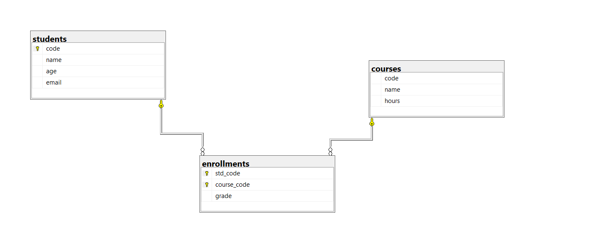

# Database Practical Exam (DDL, DML & SELECT)

**Total Marks:** 20  
**Time:** 1 Hour  
**Topics:** DDL, DML, SELECT, JOIN

---

# Overview

This repository contains a practical database exam focused on:

- DDL (Create Tables & Constraints)
- DML (Insert Data)
- SELECT Queries
- JOIN Operations

The exam is based on the following database schema:



---

# Exam Questions

##  Question 1 — DDL (8 Marks)

Write SQL statements to create the following tables:

### students
- code → Primary Key
- name
- age
- email

### courses
- code → Primary Key
- name
- hours

### enrollments
- std_code → Foreign Key
- course_code → Foreign Key
- grade

### Requirements
- Use proper constraints.
- Create relationships correctly.
- Make `(std_code, course_code)` a Composite Primary Key.

---

##  Question 2 — DML / INSERT (6 Marks)

Insert the following data into the tables:

### students
```sql
(1, 'Ahmed Ali', 20, 'ahmed@mail.com')
(2, 'Sara Mohamed', 22, 'sara@mail.com')
```

### courses
```sql
(101, 'Database', 3)
(102, 'Programming', 4)
```

### enrollments
```sql
(1, 101, 85)
(2, 102, 90)
```

---

##  Question 3 — SELECT & JOIN (6 Marks)

Write SQL queries to:

1. Retrieve all students' names and emails.
2. Retrieve all courses with hours greater than 3.
3. Display student names along with their grades.
4. Display student names with the courses they enrolled in.

---

#  Mark Distribution

| Question | Topic | Marks |
|----------|-------|--------|
| Q1 | DDL | 8 |
| Q2 | DML (INSERT) | 6 |
| Q3 | SELECT & JOIN | 6 |
| **Total** |  | **20** |


